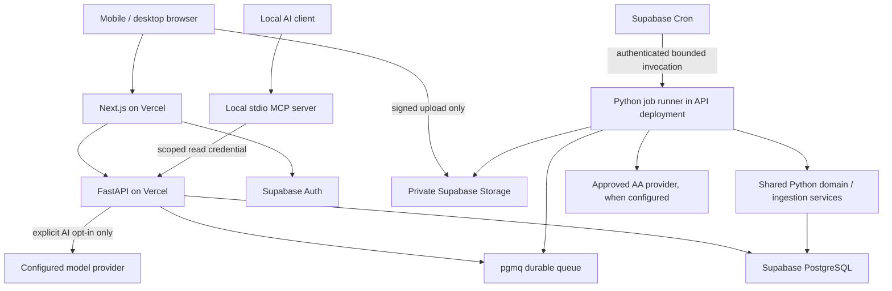

# OneLedger: end-to-end implementation plan

Status: implementation specification; no application code has been implemented or tested.

Prepared: 22 September 2026. Repository inspection found an empty directory, with no existing application, package manifests, database, tests, Git metadata, or CodeGraph index. The original specification is preserved in [product-requirements.md](product-requirements.md).

## 1. Instructions for the implementing model

Build a private, single-owner personal finance platform whose financial ledger works without Account Aggregator access or AI. Follow the phases and acceptance gates below. This document defines implementation decisions; the original requirements define product scope. New explicit owner instructions take precedence over both.

1. Inspect the repository and its current instructions before each implementation session. Reuse completed work; do not regenerate the project.
2. Read sections 2–11 before changing the financial domain. Implement one vertical slice at a time, including API, UI, migration, and meaningful tests where applicable.
3. Treat `MUST` as a release requirement. A disabled external integration is acceptable only where explicitly identified here; a mocked feature must never be presented as production functionality.
4. Keep `docs/implementation-status.md` updated with completed task IDs, exact checks run, failures, decisions, and the next task. Do not mark a phase complete from code inspection alone.
5. Keep business calculations in Python. REST, MCP, jobs, and the UI must consume the same domain services and reporting definitions.
6. Resolve routine choices using this plan. Ask only when a missing answer blocks a specific feature; continue independent work. Do not stop all development for unavailable AA credentials.
7. Do not deploy, register paid services, contact providers, or upload real financial data as part of merely implementing this plan without the relevant user instruction.
8. Do not claim production AA access, live market prices, regulatory eligibility, or test success without evidence.

Ruflo discovery was attempted through the available tool catalog; neither ToolSearch nor Ruflo tools were available in this planning session. No dependency on those tools is required to execute this plan.

## 2. Confirmed choices and scope

### 2.1 Owner decisions received during planning

| Topic | Decision |
|---|---|
| Deployment | Must run locally and on Vercel; Supabase is acceptable. |
| AI | Disabled initially; provide a secure way to configure an API key later. A key alone does not enable transmission of financial context. |
| AA access | No confirmed developer access. Start with imports. |
| Ownership | One owner initially, with per-user ownership in the schema from day one. No public registration. |

### 2.2 Defaults that do not block development

- Reporting timezone `Asia/Kolkata`, base currency INR, Indian number formatting, English UI. Store original currencies and dates; do not invent FX conversions.
- Use Supabase for PostgreSQL, authentication, private object storage, and a durable queue in the hosted deployment. Use its local Docker-backed stack for equivalent local services.
- Vercel hosts two projects from the monorepo: Next.js web and FastAPI API. MCP initially runs locally over stdio and can query either the local or hosted API with a scoped credential.
- No mandatory paid LLM, AA service, market feed, Redis, or always-on worker server for the first release.
- CSV and XLSX are mandatory. PDF support is limited to explicitly supported text-based statement templates. Scanned PDFs and unknown formats return a clear unsupported result; they never produce guessed ledger entries.
- Cloud deployment is not the same as keeping data on the laptop. Only synthetic fixtures go into preview deployments. Real data goes into the production Supabase project after the owner configures it.

### 2.3 Non-negotiable exclusions

No bank scraping, bank passwords, OTP automation, payment initiation, trading, credential reverse engineering, public signup, autonomous financial actions, fabricated balances, or silent data sharing. No microservices split of the financial domain, vector database, custom ML training, or generic plugin framework is needed.

## 3. Architecture and deployment

### 3.1 Technology decisions

| Layer | Choice and implementation rule |
|---|---|
| Backend | Python, FastAPI, Pydantic, SQLAlchemy, psycopg, Alembic. Pin mutually compatible supported versions at bootstrap and commit a lockfile. |
| Domain | Plain Python modules and Decimal arithmetic; no FastAPI or provider SDK imports in calculation modules. |
| Web | Next.js App Router, TypeScript strict mode, Tailwind, shadcn/ui components; accessible chart library selected once at bootstrap. |
| Database | PostgreSQL through Supabase. Alembic owns application schema migrations. Supabase tooling owns local platform startup, not a competing application migration history. |
| Identity | Supabase Auth; owner provisioned administratively, public registration disabled, MFA supported and required for hosted release. |
| Jobs | Supabase Queues/pgmq with persisted job status and checkpoints. Supabase Cron invokes a protected bounded Python job runner on Vercel. Local Python worker calls the same handlers. |
| Storage | Private Supabase Storage bucket; browser uploads directly using short-lived, object-specific signed upload authorization. |
| MCP | Official Python MCP SDK, initially stdio. Calls read-only API endpoints using a dedicated token. |
| AI | Disabled by default. One provider adapter implemented when Phase 4 begins, configurable model and server-side API key. |
| Testing | pytest, real PostgreSQL integration tests, HTTP API tests, Playwright critical browser flows; lint/type checks for both languages. |

Do not pin guessed version numbers in advance. Record the actual tested Python, Node, database, package, and MCP protocol versions in the README and lockfiles.

### 3.2 Runtime topology



Vercel documents native FastAPI deployment. Use a separate API project with repository-root access to the shared Python packages; prove package inclusion during Phase 0 rather than assuming the monorepo build works. [Vercel FastAPI documentation](https://vercel.com/docs/frameworks/backend/fastapi)

### 3.3 Durable work on serverless infrastructure

Do not use an in-memory task queue, an infinite worker loop inside a Vercel function, or FastAPI background tasks as the durability mechanism. Queue jobs before returning `202`. Execute bounded, restartable chunks within a request. A scheduler must resume work even if the browser closes.

Implementation contract:

- A database transaction creates `jobs` and sends a pgmq message containing only the job ID and schema version. Never enqueue raw financial payloads or secrets.
- The runner reads with a visibility timeout and acquires a per-job lease/generation. Duplicate delivery is expected. Writes require the current lease generation and idempotency checks.
- Start with at most 500 normalized rows per chunk and a 20-second application time budget. Stop before the configured function limit; provider requests have shorter explicit timeouts.
- Commit data changes, the durable checkpoint, and message acknowledgement/requeue atomically where supported in the same database transaction. On failure, do not acknowledge incomplete work.
- Do not keep a database transaction open across external network calls. Claim briefly, fetch outside the transaction, then validate lease and commit.
- Reclaim expired leases. Retry transient errors at most five times with exponential backoff and jitter; put exhausted jobs in a visible failed state with a safe retry action. Validation errors require correction, not blind retries.
- Supabase Cron invokes a fixed HTTPS runner URL every minute using pg_net, with a rotated scheduler credential kept in the platform secret store. Validate the credential before processing. Cron request payloads contain no customer data.
- The daily sync planner is idempotent by owner/date/connection. Default requested time is 02:00 in the owner's timezone; store `next_run_at` in UTC. The minute dispatcher handles due work.
- Local worker polls the same queue and exits cleanly on shutdown. Its scheduler uses the same due-job planning function.
- Phase 0 must prove queue extension availability, SQL privileges, secure scheduled HTTP invocation, retry behavior, and the deployed function budget. If the selected hosting plan cannot support this, propose moving the unchanged Python worker to a small container service; do not silently remove background processing.

Supabase provides a Postgres-backed queue and Cron; visibility timeouts enable redelivery, so application operations must remain idempotent. [Supabase Queues](https://supabase.com/docs/guides/queues/consuming-messages-with-edge-functions), [Supabase Cron](https://supabase.com/docs/guides/cron)

### 3.4 Local operation

Provide `make setup`, `make dev`, `make stop`, `make migrate`, and `make test`. `make dev` starts the local Supabase stack and Docker Compose services for web, API, and worker, using explicit local URLs and service DNS/networking. Avoid a second PostgreSQL instance alongside Supabase's database. Document host/container URL differences. Local operation must not require a cloud Supabase project or AI key.

CSV import, authentication, the dashboard, domain calculations, and local MCP must work offline after dependencies/images are installed. Use a local mail sink if the selected Auth flow needs email. No production authentication bypass disguised as a development setting.

### 3.5 Hosted boundaries

- Web calls the API server-side through a same-origin backend-for-frontend route. Forward only approved routes/headers; never build an unrestricted proxy. API validates identity independently.
- Use transaction pooling for request traffic and a direct/session connection for migrations as supported by Supabase. Use transaction-scoped owner context; never depend on session state surviving a pooled connection. Test driver prepared-statement behavior with the selected pool mode. [Supabase database connections](https://supabase.com/docs/guides/database/connecting-to-postgres)
- Upload files directly to private storage. Vercel documents a 4.5 MB function payload limit; application upload limits must not depend on proxying statement bytes through a function. [Vercel payload limits](https://vercel.com/docs/errors/function_payload_too_large)
- Do not persist files on the Vercel filesystem. Use bounded temporary files only and remove them after processing.
- Separate production, preview, and local secrets and databases. Preview builds must never run migrations against production.

## 4. Code organization and ownership

```text
apps/
  api/                  # FastAPI routes, authentication dependencies, runner entrypoint
  web/                  # Next.js UI, auth/BFF routes, generated API client
  mcp/                  # stdio MCP adapter and tool schemas
packages/
  finance-domain/       # Python package oneledger_domain: ledger and calculations
  database/             # oneledger_db: ORM, queries, repositories, migrations support
  providers/            # oneledger_providers: canonical inputs, imports, AA adapters
  categorization/       # oneledger_categorization: rules and optional classifier
  shared/               # oneledger_shared: configuration/errors; only actual shared code
infrastructure/
  migrations/           # Alembic revisions: sole application-schema authority
  docker/
  deployment/           # Vercel setup, Supabase bootstrap, scheduler setup
supabase/                # local platform configuration
scripts/
tests/
  unit/
  integration/
  providers/
  e2e/
  fixtures/              # synthetic and licensed/public templates only
  security/
docs/
  product-requirements.md
  implementation-plan.md
  implementation-status.md
  architecture.md
  financial-semantics.md
  security.md
  providers.md
  deployment.md
  runbooks.md
pyproject.toml
uv.lock
pnpm-workspace.yaml
pnpm-lock.yaml
docker-compose.yml
.env.example
.gitignore
Makefile
README.md
```

These are boundaries, not a demand for empty scaffolding. Create files as their phase needs them. Use workspace packages rather than runtime `sys.path` edits. API and worker import the same ingestion services. MCP calls the API; it does not duplicate financial queries or receive database-owner credentials.

## 5. Financial model: invariants before implementation

### 5.1 Money, dates, and signs

- Monetary database columns use `NUMERIC(24,8)`; Python uses `Decimal`. Validate currency precision at ingestion (INR two decimal places). Quantities/prices use separately documented higher precision. No binary floats in money calculations.
- JSON money is a decimal string, for example `"-1250.00"`, alongside `currency`. Do not send money as JSON floating-point numbers. The frontend formats strings without using floating-point arithmetic for business totals.
- `transaction_date` and `value_date` are source-local dates. `occurred_at` is an optional timezone-aware instant. Never fabricate a time for a date-only statement. `created_at`, `updated_at`, provider retrieval times, and job times are UTC timestamps.
- API date intervals are `[start_date, end_date_exclusive)`. The UI translates an inclusive end-date selection. “Last month” means the previous calendar month in the owner's timezone.
- Each account has a kind and natural balance: assets are positive amounts held; liabilities are positive amounts owed. A canonical transaction's signed `amount` is its contribution to account equity: positive improves net worth, negative reduces it before paired movements.
- Therefore bank deposit `+`, bank withdrawal `-`, card purchase `-`, card payment received `+`, loan borrowing on the loan account `-`, loan principal repayment on the loan account `+`. Liability balance change is `-amount`; asset balance change is `amount`.
- Keep the source's debit/credit label separately. Canonical `direction` is derived from signed amount; source-specific card conventions are normalized by the parser.
- Exclude pending, voided, merged, and soft-deleted transactions from posted reports. Show pending separately. Preserve pending-to-posted lineage.

### 5.2 A transaction is an account movement, not automatically an expense

Use `transactions` as canonical account movements, `transaction_allocations` for economic meaning, and `transfers` to link opposite account movements. This is a personal account ledger with reconciliation, not a full general-ledger product.

Every posted transaction has one or more allocations whose signed amounts sum exactly to its amount. An unsplit transaction has one allocation. Allocation effect is one of:

`income`, `expense`, `transfer`, `investment`, `loan_principal`, `adjustment`, `unclassified`.

Effect determines reporting; category determines presentation. Renaming a category to “Transfers” must not change the accounting effect. A positive expense allocation represents a refund; it is not income. An investment category does not automatically create a holding.

Imported date/amount/account/source identity are immutable source facts. User changes are annotations or audited corrections. To correct a parsed amount, create a revised canonical version and preserve the original raw row and revision history. Never rewrite raw evidence.

### 5.3 Reporting definitions

| Metric | Exact behavior |
|---|---|
| Income | Sum signed allocations with effect `income` in the reporting period. Excludes borrowing, asset sales, transfers, and refunds. |
| Net expenses | Negative of the sum of allocations with effect `expense`. Purchases increase expenses; linked refunds reduce them on the refund posting date. |
| Unclassified outflow | Separate total/count of negative unclassified allocations. Display beside expenses; do not silently exclude without a completeness warning. |
| Cash flow | Inflows/outflows over selected liquid asset accounts. Provide both gross account movements and external flow excluding confirmed internal transfers; identify selection scope. |
| Investment contributions | Purchases/contributions, withdrawals, and net contributions shown separately; transfers to brokerage cash alone are not security purchases. |
| Loan payments | Actual cash paid, principal, interest, and fees shown separately. Principal is not consumption expense. |
| Bank balance total | Latest valid balance for each included bank account, with per-account as-of date and unknown/stale counts. Never sum all historical snapshots. |
| Net worth | Included asset valuations minus included liability balances at an as-of cutoff, grouped by currency unless supported FX rates exist. |
| Savings | Income minus net expenses, clearly separate from cash balance change. Unknown allocations make it provisional. |

A partial account selection can show a transfer out of that selection as boundary cash flow, but must still identify it as an internal transfer rather than consumption expense.

### 5.4 Required movement behavior

| Event | Ledger representation and expected reporting |
|---|---|
| Salary ₹100,000 | Bank `+100000`, income allocation; income ₹100,000. |
| UPI food ₹650 | Bank `-650`, expense/Food; UPI is a payment channel, not another account movement. |
| Own-bank transfer ₹50,000 | Source `-50000`, destination `+50000`, linked transfer; expense/income zero. |
| Refund ₹200 for ₹650 purchase | Separate `+200` expense allocation linked to purchase; net expense ₹450 if both dates are in range. |
| Full reversal | Preserve original and opposite reversal and their link. Their combined effect nets to zero; do not exclude just one leg. |
| Cash withdrawal ₹2,000 | Bank `-2000`, tracked cash `+2000`, transfer; subsequent cash purchase is the expense. |
| Card purchase ₹3,000 | Card `-3000` expense; liability rises ₹3,000. |
| Card bill payment ₹3,000 | Bank `-3000`, card `+3000`, transfer; no second expense. |
| Loan EMI ₹10,000 | Bank `-10000` split into principal `-8000` and interest expense `-2000`; loan `+8000` principal movement; match principal allocations. |
| Investment purchase ₹5,000 | Bank/broker cash decreases and holding quantity increases; investment allocation, no consumption expense. Separate brokerage fee is expense. |
| Opening balance | Balance snapshot or explicit opening adjustment, never income. |

When the other side is absent, create a review item and indicate incomplete coverage. A user may explicitly classify an unmatched card payment or own-account transfer without fabricating a provider record. User-created cash or loan counterpart movements are marked `MANUAL_DERIVED` and linked, and must be reconciled rather than inserted again if source data later arrives.

## 6. Database design and constraints

### 6.1 Common conventions

UUID primary keys; `owner_id` on all private records; foreign keys; UTC timestamps; `version` for optimistic concurrency on editable resources. Add `deleted_at` only to editable logical records. Raw records and audit records are append-only, subject to documented retention/purge workflows.

Use a private application schema not exposed by the Supabase Data API. All application queries filter by authenticated owner. Add RLS using transaction-local authenticated owner context and a restricted database role without `BYPASSRLS`; test with the actual runtime role, not the migration owner. Use composite `(owner_id, id)` constraints/FKs where they prevent linking another owner's account, category, transaction, or import.

Workers obtain owner IDs from authenticated, persisted jobs, never arbitrary request parameters. Admin/migration credentials never serve normal requests.

### 6.2 Tables and required fields

Columns below are in addition to common identifiers/timestamps. Implement each group when its phase arrives.

| Table | Required fields / relationships |
|---|---|
| `users` | Supabase auth subject, display name, timezone, base currency, owner enabled flag. |
| `financial_institutions` | Stable institution code, name; shared public reference data allowed. |
| `accounts` | Owner, institution, name, kind, currency, masked identifier, status, include-in-net-worth, opening date. Never merge accounts from last four digits alone. |
| `account_connections` | Provider, remote account identifier encrypted where sensitive, canonical account FK, status, capabilities, checkpoint metadata. |
| `consents` | Connection/provider consent reference, status, purpose, account/data scope, date range, frequency, expiry, data-life/retention terms, local paused flag, encrypted artifact pointer. |
| `financial_data_fetches` | Consent, sync run, provider request/session ID, requested interval, status, attempts, requested/completed timestamps. |
| `raw_financial_records` | Fetch or import FK, object pointer/row location, content hash, parser/schema version, retrieval time, expiration. Sensitive payload remains encrypted/private. |
| `transactions` | Account, signed amount/currency, dates, optional timestamp, status, movement type, payment channel, raw description, normalized merchant, source, source reference, revision, deleted/merged state. |
| `transaction_sources` | Canonical transaction, raw record, provider namespace/account/reference or import row identity; supports many sources for one movement. |
| `transaction_allocations` | Transaction, signed amount, effect, category, optional refund/loan/investment relation, classification source/confidence/model/version, manual lock. |
| `transaction_categories` | Owner, stable code, display name, parent, archived flag. Acyclic hierarchy; seed the original specification's category tree. |
| `transaction_category_rules` | Owner, enabled, priority, validated conditions, target category/effect, version. No executable user code. |
| `transaction_merchants` | Owner, normalized name, aliases, optional category mapping. Keep merchant normalization separate from raw text. |
| `transaction_tags` / `transaction_tag_links` | Owner tags and unique transaction/tag relation. |
| `transfers` | Owner, match status, reason/evidence, method, confidence, confirmation time. |
| `transfer_legs` | Transfer, allocation, signed matched amount; initially one-to-one equal-currency matching. |
| `transaction_relations` | Original/refund/reversal/duplicate/correction links, allocated refund amount, reason. |
| `loans` | Liability account FK, lender/type, original principal, opening outstanding/date, start/maturity, EMI day/amount, interest convention, rate schedule. |
| `loan_rate_changes` | Loan, annual rate, effective date, source. |
| `loan_payments` | Loan, payment transaction/allocation links, principal, interest, fees, prepayment, date, actual/estimated flag. |
| `credit_cards` | Liability account FK, issuer, masked identifier, credit limit, statement day, due-day convention. |
| `credit_card_statements` | Card, period, statement balance, minimum due, due date, payment state, source record; statement balance is not a new transaction. |
| `investments` | Owner/account, instrument type, identifiers, name, currency, units or manual asset mode. |
| `investment_transactions` | Investment, linked ledger transaction, action, units, unit price, gross amount, fees, date. |
| `investment_valuations` | Investment, date, unit price/value, source, currency, estimated flag; no fake live quotes. |
| `cash_accounts` | One-to-one account FK and cash-specific notes; no parallel balance source. |
| `recurring_transactions` | Account/merchant/category, type, cadence, tolerance, sample count, expected next date, confidence, accepted/dismissed state. |
| `recurring_transaction_members` | Recurrence to transaction links with uniqueness. |
| `budgets` | Category/account scope, period, currency, amount, start date; explicit no-rollover default. |
| `financial_goals` | Name, target amount/currency/date, funding-account scope or manual progress mode. |
| `balance_snapshots` | Account, amount, balance kind, as-of, source, observed/derived flag, reconciliation state. |
| `net_worth_snapshots` | Owner/date/currency, asset/liability totals, component values and source snapshot IDs, coverage and revision. |
| `sync_runs` | Connection, trigger, range, status, counters, started/completed, checkpoint. |
| `sync_errors` | Run/job, safe error code, retryable flag, redacted diagnostic reference. |
| `imports` / `import_rows` | File identity, account/mapping/parser versions, state, preview hash, source row, normalized candidate, validation/dedup decision, final transaction link. |
| `jobs` | Type, owner, status, attempts, next attempt, lease generation/expiry, checkpoint, safe failure code. |
| `audit_logs` | Actor, action, entity ID, changed field names, protected revision reference, timestamp, correlation ID. No raw amounts/descriptions/secrets in ordinary logs. |
| `transaction_revisions` | Protected before/after financial facts, reason, actor, transaction version. |
| `review_items` | Kind, related entities, evidence, status, resolution; duplicate, transfer, categorization, or reconciliation review. |
| `api_tokens` | Owner, keyed token hash, label, scopes, expiry, last-used, revoked-at; reveal token once. |
| `ai_settings` / `user_secrets` | Disabled/enabled state, provider/model, opt-in timestamp and policy version, encrypted key, key version, masked suffix. |
| `ai_runs` | Request ID, model, tool names and result references, status/cost counts; content retention off by default. |
| `anomalies` | Rule/version, transaction/account reference, safe reason, detection time, dismissed status. |

`income_records` and `expense_records` MUST exist as read-only database views over active allocations, not independent mutable copies of transactions. This meets the source specification without introducing multiple sources of truth. Application access to views must preserve RLS/owner scope; use security-invoker behavior supported by the selected PostgreSQL version.

### 6.3 Required indexes and integrity

- Transactions: `(owner_id, transaction_date DESC, id DESC)`, `(owner_id, account_id, transaction_date)`; add merchant/category search indexes based on actual queries.
- Unique source identity: `(owner_id, provider_namespace, canonical_account_id, source_transaction_id)` where an ID is present; define provider ID scope from its contract.
- Import replay identity: `(owner_id, account_id, file_sha256, mapping_version, parser_version)` and unique import/row location. Same bytes with a different mapping require preview, not automatic reinsertion.
- Allocation sum equals parent amount, checked inside the same locked transaction; add a deferred database constraint trigger to prevent invalid committed splits.
- Match constraints prevent an allocation's matched total exceeding its absolute value. Confirming transfers locks all involved rows in a stable order.
- Unique job scheduling/idempotency keys; unique active canonical source association; dedup fingerprints are indexed but are not globally unique.
- Category cycles, invalid currencies/precision, negative liability principal inputs, and cross-owner relationships are rejected.
- `income_records`/`expense_records`, all reports, and exports consistently exclude merged/deleted/non-posted rows.

## 7. Import, normalization, and duplicate detection

### 7.1 Import state machine

`UPLOADING → UPLOADED → PARSING → NEEDS_MAPPING → VALIDATING → PREVIEW_READY → CONFIRMED → COMMITTING → COMPLETED`

Mapping may be skipped for a saved recognized template. Failures use `FAILED` with a stage/error; cancelled/expired sessions cannot commit. Only authenticated explicit confirmation moves a preview toward the ledger.

1. Create import with account, format, byte limit, storage key, and short-lived signed upload authorization.
2. Complete upload; server verifies object ownership, actual size, magic/type, hash, and supported format. A filename/MIME header is not sufficient.
3. Parse to staging rows. Preserve original row location, raw strings, parser version, and validation errors.
4. Map date, amount or debit/credit columns, description, reference, and optional balance. Require an explicit date format for ambiguous dates. Support parentheses, Indian grouping, debit/credit suffixes, blank columns, and configurable delimiter/encoding.
5. Normalize and run duplicate/transfer candidate detection without changing the ledger.
6. Show valid/rejected/duplicate/ambiguous counts, totals by currency, date coverage, sign interpretation, sample rows, and possible duplicates. Zero financial writes before confirmation.
7. Confirm a preview hash covering file, mapping, parser version, normalized rows, and selected resolutions. Reject stale preview versions with `409`.
8. Commit bounded chunks idempotently to an import batch initially marked unpublished. Reports ignore unpublished import transactions. Publish the batch only after all accepted rows commit successfully, then schedule matching/categorization.
9. Concurrent imports must serialize final source matching per account and recheck duplicates at commit. If decisions changed since preview, return to review rather than silently discarding extra rows.
10. Complete with inserted/linked/rejected/review counts and downloadable safe errors. User may explicitly approve importing valid rows while rejecting invalid rows; never silently drop them.

Set initial limits: 20 MiB per file, 100,000 rows, XLSX 100 MiB uncompressed, 200 PDF pages, 2,000 characters per description; reject with actionable errors. Lower supported PDF/Excel limits if measured memory/time requires it. Unsupported large inputs must fail before partial publication.

CSV uses the standard parser. XLSX uses a maintained library in read-only mode; reject XLS/XLSM initially, external links and macros, and never evaluate formulas. Handle ZIP bombs. PDF uses a bounded template parser, no OCR/LLM by default. Password-protected PDFs may be declined with instructions to export CSV; do not persist statement passwords.

### 7.2 Duplicate identity: conservative and lossless

Never use `(date, amount, description)` as a unique transaction key. Two identical purchases can both be real.

Priority:

1. Same import session/row or same validated file/account replay: idempotent link, no new transaction.
2. Stable provider ID in its documented account/provider namespace: upsert source association; treat changed facts as a revision/reconciliation case, not a silent replacement.
3. Cross-source stable reference plus account/currency/amount and compatible date: auto-link only when unique and unambiguous.
4. Fallback fingerprint: hash versioned canonical account/date/amount/currency/normalized description/reference. Preserve multiplicity; identical rows within a file remain separate candidates.
5. Overlapping files without reliable references: use running balances and ordered neighborhood evidence when available. Otherwise flag possible duplicates for user review, preserving both candidates until resolved.

Do not put provider name into the sole cross-source fingerprint. AA and CSV imports of the same bank transaction must be matchable. Do not include mutable category/merchant annotations in identity. Never auto-dedup across different accounts.

Manual merge selects a survivor, moves source links, preserves revisions/tags and a redirect relation, soft-marks the loser, and invalidates derived reports atomically. Conflicting splits, transfers, or loans require explicit resolution. Allow undo from preserved state; a merge is not destructive deletion.

## 8. Transfers, categorization, and reconciliation

### 8.1 Transfer matching

Candidate retrieval: same owner/currency, different accounts, opposite allocation signs, exactly equal amounts, dates within three calendar days, both eligible and unmatched. Cross-currency transfers require explicit amounts/rate and manual confirmation initially.

Automatic confirmation requires a unique candidate pair and strong identity evidence: the same reliable reference plus compatible own-account identifiers/type, or explicit source transfer metadata identifying both owned accounts. Amount/date alone creates a suggestion, never automatic expense suppression.

Handle card payment as a liability transfer and loan principal as a partial allocation transfer. Transfer fees stay expenses. Ambiguous many-to-many/batched matches are manual in the first release. Persist evidence and algorithm version. User confirmation/rejection wins over future automatic runs.

Editing or merging a matched transaction invalidates affected matches and schedules reconciliation. Do not leave a dangling match that suppresses a real expense.

### 8.2 Categorization

Order: locked user correction → explicit enabled user rule → known merchant mapping → built-in deterministic patterns → optional AI suggestion → unclassified fallback.

Rules use a typed condition schema (account, normalized text contains/prefix, merchant, amount range, channel), ordered by explicit priority then stable ID. Do not allow Python/SQL execution; avoid unrestricted regex initially. A dry-run shows affected transactions before bulk application.

Store category, effect, classification source, rule version, confidence, model and model version where applicable. Rule confidence is not a statistical guarantee. AI confidence is advisory; initial AI results are proposals requiring user approval.

A correction offers a prefilled reusable rule. Saving the rule requires preview/confirmation; one corrected purchase must not automatically relabel unrelated transactions. Manual locks survive imports, provider refreshes, and rule reruns.

Seed all category families and subcategories listed in the original brief. Support custom categories with the same data model; archived categories remain attached to history. “Income / Refund” is a display label only when appropriate; linked purchase refunds use the expense treatment defined earlier.

### 8.3 Balances and completeness

Store balances independently from transaction aggregates. Distinguish current/booked, available, statement, and projected balances. Available credit is not an asset or a bank balance.

For assets: expected closing = opening + sum(posted amounts). For liabilities: expected closing owed = opening owed - sum(posted amounts). Compare like-for-like snapshot kinds and dates. Reconciliation discrepancy creates a review item; never insert a balancing transaction silently.

When coverage is incomplete, show observed balance and unexplained delta. Do not infer an account's current balance from an arbitrary first transaction. A manual opening balance is explicit and auditable.

Every summary returns included accounts, coverage dates, last retrieval/as-of times, unknown balances, stale balances, pending/review counts, and whether the result is partial. Partial data is not zero.

## 9. AA providers, consent, and synchronization

### 9.1 Research findings and eligibility gate

The retrieved RBI direction defines an FIU as an entity registered with and regulated by a financial-sector regulator. That definition does not establish this personal application's eligibility. The retrieved page is labelled updated September 2024; recheck official requirements before actual onboarding. [RBI AA Master Direction](https://www.rbi.org.in/Scripts/BS_ViewMasDirections.aspx?id=10598)

OneMoney's official portal describes FinPro and network API integration for FIU applications, consent-driven requests, and a business-team agreements/pricing step. It does not establish that an unaffiliated individual can retrieve linked accounts through a production API. [OneMoney developer documentation](https://docs.onemoney.in/)

OneMoney's published onboarding guide describes an organization ID, sandbox choices, application/network keys, and test-data modes. This older guide is evidence of a documented sandbox path, not confirmation of present individual access or production authorization. [OneMoney onboarding guide](https://www.onemoney.in/docs/resources/Onemoney%20Group%20suggested%20steps%20by%20FIUs%20and%20FIPs%20%20to%20onboard%20onto%20AA%20Ecosystem.pdf)

Before implementing live provider calls, complete this evidence checklist in `docs/providers.md`:

| Required question | Current conclusion / required evidence |
|---|---|
| Personal/PFM product available? | Public docs show FIU-oriented products; exact personal-use offering unconfirmed. Obtain provider confirmation. |
| Individual developer credentials? | Developer portal exists; individual eligibility and approval are unconfirmed. |
| FIU/PFM relationship? | Regulatory FIU definition exists; approved integration/partner arrangement for this application must be established. |
| Onboarding obligations? | Contract, pricing, production approval, security/data handling and geographic restrictions need current provider terms. |
| Consent flow? | Purpose/time-scoped consent documented; use the exact approved SDK/redirect contract, not invented URLs. |
| Returned formats? | Obtain versioned schemas, decryption/signature requirements, sample data and transaction-ID semantics for the selected product. |
| Recurring/incremental fetch? | Verify frequency, retention/data life, history depth, pagination, rate limits, refresh semantics, and institution coverage. |
| Sandbox? | Documented by official guide; verify actual access and current endpoints. |
| Personal-project limitations? | Not resolved by public documentation. Keep production disabled until confirmed. |

No contact with OneMoney is authorized or performed by this document. No eligibility outcome is assumed. Lack of access blocks only the live adapter, not the ledger, imports, consent model, or sync infrastructure.

### 9.2 Provider contract

Use a small `FinancialDataProvider` protocol with capability flags and typed results:

```python
# Contract sketch, not a production implementation.
class FinancialDataProvider(Protocol):
    async def capabilities(self) -> ProviderCapabilities: ...
    async def create_consent(self, request: ConsentRequest) -> ConsentSession: ...
    async def get_consent_status(self, reference: str) -> ConsentState: ...
    async def fetch_accounts(self, context: ProviderContext) -> AccountPage: ...
    async def fetch_transactions(self, request: FetchRequest) -> TransactionPage: ...
    async def fetch_balances(self, request: BalanceRequest) -> BalancePage: ...
    async def revoke_consent(self, reference: str) -> RevocationResult: ...
```

Canonical results contain external identity, decimal money, dates/time precision, status, raw-record locator, pagination cursor and capabilities; no SQLAlchemy entities. Provider errors distinguish unsupported capability, missing configuration, access denied, expired consent, rate limited, transient failure, and invalid data.

CSV/XLSX providers implement normalization/import behavior and explicitly declare consent/network-fetch operations unsupported. Do not construct a fake AA consent for a manual upload. A OneMoney adapter boundary may return `PROVIDER_NOT_CONFIGURED`; do not invent HTTP requests to make it look finished. Mock fixtures are enabled only in local/test profiles, visually labelled, and prohibited for production accounts.

### 9.3 Consent lifecycle

Track pending, active, rejected, expired, revocation-pending, revoked, and error. Keep local scheduling pause separate from external consent status.

- Consent creation needs explicit scope/purpose/frequency/range confirmation in the UI.
- Redirect callbacks are state-bound and verified. A redirect alone is not proof of active consent; verify server-side.
- Pause immediately stops local fetch scheduling. Say whether provider-level suspension is supported.
- Revoke immediately stops new local work and sends an idempotent external request. Show “revocation pending” until confirmed; retry safely.
- Revalidate consent before each remote fetch and before committing returned data. A revocation race must not publish a late result.
- Cancel outstanding work on expiry/revocation. Do not advance checkpoints when access is denied.
- Retain/delete existing fetched data according to actual consent data-life and contract terms. Revocation and historical-data deletion are distinct operations; provide documented purge handling when required.

### 9.4 Sync pipeline

`plan → verify consent → fetch/poll → preserve raw → validate → normalize → deduplicate → commit → match → categorize → reconcile → refresh derived data → report`.

Only one active fetch window per connection/account. Use durable leases and unique run keys. Persist page checkpoints only with committed page data; a failed page is retryable without duplicates. Default overlap is seven days when allowed; make it provider-specific and periodically re-fetch permitted history to catch older corrections. Never request outside consent scope or frequency.

Counters distinguish fetched raw rows, valid, rejected, new, source-linked duplicate, revised, categorized, and review-required. Do not force mutually nonexclusive counters into a misleading sum. Verify webhooks against the chosen provider's signing contract, deduplicate event IDs, reject replay, and re-fetch status when an event is ambiguous.

## 10. Loans, cards, investments, budgets, and advanced analytics

### 10.1 Loans

Store observed principal separately from a calculated schedule. Inputs: principal, annual nominal rate, effective rate dates, start/date convention, EMI amount/day, remaining term, interest convention, and prepayment policy.

For the supported fixed-rate monthly reducing-balance estimate: `r = annual_rate / 12`; `EMI = P*r*(1+r)^n / ((1+r)^n-1)`; when `r=0`, `EMI=P/n`. Validate positive term and nonnegative supported rate. Use Decimal; round posted components to currency precision, carry internal precision, and adjust the last payment to clear principal. Reject negative-amortization scenarios as unsupported unless explicitly modelled.

Actual lender-reported components take precedence. Do not present a monthly estimate as exact for daily-accrual, floating-rate, irregular-period, moratorium, or fee-bearing loans. Support effective-dated rates in projected schedules, label assumptions, and preserve manual/lender corrections.

Prepayment simulation defaults to reducing tenure with EMI unchanged; offer EMI reduction as a separate scenario. Simulation never changes actual outstanding. Persist a prepayment only through explicit manual entry/source import. Show actual principal/interest paid and projected remaining interest separately.

### 10.2 Credit cards

Import purchases/refunds/payments using explicit card sign mappings. Capture statement periods, balance, minimum due, due date, limit, and statement payment status. A statement summary never duplicates its transactions. Support partial/late payments and separate fees/interest. A bank-only card payment remains an identified liability payment with missing card-detail coverage, not guessed category spend.

### 10.3 Investments and other assets

Support manual holdings, dated valuations, contributions/purchases/sales, dividends, fees, and links to bank/brokerage movements. Instrument types include stocks, mutual funds, ETFs, PPF, NPS, FD, gold, and other assets. For assets without meaningful units, use dated manual total value.

Do not count both an FD account balance and an investment object representing that same FD. Give every net-worth component one canonical valuation owner. Brokerage cash and security holdings are distinct. Sell proceeds are not salary/income; distinguish proceeds, return of capital, realized gain, and fees when cost basis is known. Unknown cost basis means unknown gain.

No live-price claim without a licensed/configured feed and timestamp. Multi-currency totals remain separate; future conversion requires dated, sourced FX rates and coverage metadata.

### 10.4 Net worth history

For cutoff date D, select the latest eligible balance/valuation at or before D for each component. Never backfill D using a later observation. Missing components produce a partial total. Snapshots store source IDs and calculation version; corrections mark affected snapshots stale and rebuild them. Keep previous revisions for audit.

Show 30-day, 90-day, and one-year changes only when comparable coverage exists. Otherwise display unavailable/coverage-changed, not a misleading percentage. Explain net-worth change using balance movements, investment valuation change, and unexplained residual separately.

### 10.5 Recurrence, budgets, goals

Start recurrence detection with at least three posted occurrences and merchant/account/direction grouping. Detect weekly, calendar-monthly, quarterly, and annual candidates; calendar-month cadence must handle February and month-end. Use documented day/amount tolerances, median typical amount, and allow variable utility bills. User confirmation/dismissal persists. Missed/overdue occurrences are forecasts, never inserted actual transactions.

Monthly category budgets default to no rollover; spending uses the same expense/refund allocations as analytics. Category-parent totals include descendants once. Warn when overlapping budget scopes could confuse totals. Goals use either linked account balances or explicit progress entries, never both for the same contribution. Neither budgets nor goals create money movements.

### 10.6 Anomalies and forecasts

Phase 5 uses transparent rules: unusually large merchant/category spend relative to sufficient personal history, new large merchant, repeat charge, and unusual fee. Use robust median/deviation rules with explicit minimum sample size; no claim of fraud detection. Explain the threshold and evidence, allow dismissal, and never mutate the ledger.

Forecast from known recurring income/expenses and confirmed schedules for 30/90 days. Report assumptions, missing coverage, and scenarios; no invented statistical confidence interval. Insufficient history yields “not enough data.” Financial insights distinguish observed facts, calculated values, assumptions, and interpretation.

## 11. API contracts

### 11.1 Shared conventions

Prefix `/api/v1`. Pydantic models drive OpenAPI and generated TypeScript types. Validate owner identity server-side; never trust `owner_id` in input. Unknown/foreign IDs return the same safe not-found behavior.

Use keyset pagination with default 50/max 200 and stable date+ID order. Whitelist sort columns. Bound search length, date intervals, and tool response size. Escaped text/full-text search uses parameterized queries, never model-generated SQL.

POST operations with side effects accept `Idempotency-Key`, bound to owner, route, and request hash. Reusing the key with different content returns `409`. Updates use expected `version`/`If-Match`. Financial mutations, audit entry, and derived-data invalidation commit together.

Error envelope:

```json
{"error":{"code":"IMPORT_PREVIEW_STALE","message":"Regenerate the preview before confirming.","request_id":"uuid","details":{}}}
```

No stack traces, tokens, raw payloads, SQL, or unredacted provider errors in responses. Use `401`, `403`, `404`, `409`, `422`, `429`, `503` consistently.

Aggregate response contract:

```json
{
  "data": {"net_expenses": "12840.00", "currency": "INR"},
  "provenance": {
    "query_id": "uuid",
    "start_date": "2026-08-01",
    "end_date_exclusive": "2026-09-01",
    "timezone": "Asia/Kolkata",
    "account_ids": ["uuid"],
    "transaction_count": 42,
    "as_of": "2026-09-22T06:00:00Z",
    "calculation_version": "expenses-v1",
    "ledger_revision": 17,
    "partial": false,
    "warnings": [],
    "evidence_url": "/transactions?query_id=uuid"
  }
}
```

Store the normalized query and ledger revision behind an owner-scoped query ID so evidence is reproducible. For large reports return paginated evidence, not thousands of IDs in every response. An evidence link must not rely on a public bearer URL. If the ledger changed, disclose that a refreshed result differs from the earlier revision.

### 11.2 Endpoint inventory

| Group | Required operations |
|---|---|
| Auth/settings | Server-side login/callback/logout/refresh, owner profile/timezone, MFA enrollment/verification, active session management. |
| Accounts | List/create/detail/update/archive; latest balances/history; masked identifiers only. |
| Transactions | Filter/list/detail; manual entry; annotations/category/tags; split; soft-delete/restore manual entries; imported correction workflow. |
| Review | List review items; confirm/reject duplicate or transfer; merge/undo; reconcile discrepancy. |
| Categories/rules | CRUD/archive, rule dry-run/apply, merchant mappings. |
| Imports | Create signed upload; complete; map; preview; confirm; status; cancel; error download. |
| Analytics | Income, expenses, category breakdown, monthly comparison, cash flow, balance change explanation, dashboard. |
| Providers/connections | Capabilities/status, eligible connect flow, account mapping. |
| Consents | Scope preview/create, list/detail/status refresh, local pause/resume, revoke. |
| Sync | Manual/historical request, run list/detail, retry failed run. |
| Cards/loans | Card details/statements/payments; loan details/payments/rate changes/schedule/prepayment simulation. |
| Investments | Holdings, movements, manual valuations, dated summaries. |
| Planning | Recurrences accept/dismiss, budgets/progress, goals/progress. |
| Net worth | Current/history/components, snapshot rebuild status. |
| AI | Read/update provider settings; set/delete/test key; opt-in/disable; assistant query/result; classification suggestions. |
| Tokens/audit | Create/list/revoke scoped MCP token; owner audit history; secure export. |
| Advanced | Anomalies/list/dismiss, forecasts, insight evidence. |
| Internal | Liveness/readiness; scheduler runner and provider webhook endpoints with separate authentication. |

## 12. Authentication, privacy, and operational security

- Use Supabase Auth with allowlisted owner subject; disabling signup is not the only control. Another valid Supabase user still cannot become this application's owner.
- Use a server-only auth/BFF flow with secure, SameSite cookies and HttpOnly session material. Do not add a browser auth client that requires reading HttpOnly tokens. Implement refresh and cookie propagation on the server, tested against the chosen Supabase SDK. Follow PKCE callback/state handling.
- Require MFA for hosted use; verify assurance level for sensitive actions such as adding secrets, exporting all data, and issuing MCP tokens. Document a recovery procedure that does not add a permanent bypass.
- Cookie-authenticated mutations require origin/CSRF checks. Restrict allowed origins and callback URLs; do not trust forwarded host headers blindly.
- No shared caching/ISR of authenticated financial pages, API responses, or Set-Cookie responses; use private/no-store. Supabase specifically documents session exposure risks from caching refreshed cookies. [Supabase SSR guidance](https://supabase.com/docs/guides/auth/server-side/advanced-guide)
- Validate JWT signature, issuer, audience, expiry and owner status. Short-lived tokens, revoked session behavior, refresh failures, and key rotation must be tested. Never decode a JWT without verification.
- Enforce rate limits on login, imports, AI, search, and token issuance using shared database state or platform controls, not only per-process memory. Start with documented configurable caps.
- Private storage policies and path ownership protect upload/download. Signed URLs expire quickly and never appear in logs or analytics.
- Runtime credentials have least privileges. Production database, storage, and backups require encryption at rest; use TLS for connections. Local use relies on encrypted host disk plus private volumes, documented explicitly.
- Encrypt stored provider and AI secrets with a maintained authenticated-encryption library; master key lives outside the database in deployment secrets. Store key version; support rotation. Do not invent cryptography.
- Logs use an allowlist: request/job IDs, stage, duration, counts and safe error codes. Disable request-body capture and redact authorization/cookies/URLs. Separate access-controlled financial revision history from operational logs.
- Configure CSP/security headers and render descriptions as plain text. Escape spreadsheet exports beginning with formula control characters. Test malicious descriptions, filenames, archives and PDF content.
- Restrict outbound provider/model hosts to administrator-configured approved HTTPS endpoints. No user/model-controlled URL fetches, internal IP access, shell, arbitrary SQL, or browser automation.
- Retention defaults: uploaded raw files/staging 30 days after completed import, operational logs 30 days, financial ledger/revisions until explicit owner purge. AA terms can impose shorter retention. Purging raw data leaves source hash/parser metadata and a clear “raw evidence expired” status.
- Soft deletion is the default financial edit. A separate authenticated, confirmed data-erasure workflow handles required permanent deletion, private objects, secrets, and eventual backup expiry. Do not pretend soft deletion erases sensitive data.

## 13. MCP and AI behavior

### 13.1 Initial MCP delivery

Implement a local stdio server that reads `ONELEDGER_API_URL` and a dedicated read-only token from environment/OS secret configuration. It works against local or hosted OneLedger. No unauthenticated public MCP endpoint is required.

Issue high-entropy API tokens, store only a keyed hash, attach scopes and expiry, and allow immediate revocation. Scopes: `finance:read` plus optional `transactions:read-detail`. Do not issue write, consent, secret, or admin scopes to MCP. Log tool name/count/latency, not payload.

Expose all tools requested in the brief:

- `get_accounts`, `get_account_balance`, `get_all_balances`.
- `get_transactions`, `search_transactions`, `get_income`, `get_expenses`.
- `get_spending_by_category`, `get_monthly_summary`, `get_recurring_transactions`.
- `get_loans`, `get_loan_summary`, `get_investments`, `get_net_worth`.
- `find_anomalies`, `get_financial_goals`.

Each tool has typed inputs, bounds, pagination, and the shared provenance envelope. Set read-only annotations, but enforce read-only behavior in the API; annotations are not authorization.

Future remote Streamable HTTP MCP requires a separately verified OAuth authorization flow and audience-bound tokens; do not relabel a Supabase session JWT as an MCP token. The MCP specification requires audience validation and prohibits passing an incoming MCP token through as an upstream API credential. [MCP authorization security considerations](https://github.com/modelcontextprotocol/modelcontextprotocol/blob/main/docs/specification/2026-07-28/basic/authorization/security-considerations.mdx)

### 13.2 Bring-your-own-key settings

Provide a Settings → AI page with provider, model, password-style API-key field, key-status display, test, replace/delete key, and a separate enable/data-sharing control.

- POST key over TLS; encrypt server-side; return only configured status and masked suffix. Never return the secret in GET, HTML, client bundles, error telemetry, localStorage, or audit diffs.
- Support a server environment key for local/deployment configuration as well as an encrypted owner key. Define explicit precedence: owner key if configured, otherwise server key. No key means AI unavailable, with ordinary finance features unaffected.
- “Test connection” explicitly authorizes a minimal provider request containing no financial data. Saving a key does not authorize classification or chat.
- Enabling AI explains what summarized fields are shared and records opt-in. Separate background classification opt-in from interactive questions.
- Provider/model choice is an implementation-time decision; do not assume a particular vendor or claim an API-key format is universally supported. Implement one real supported provider first behind a narrow interface.
- Set per-request timeout, maximum tool rounds (initially six), response size, daily usage budget and concurrency cap. On failure, show deterministic report results and a safe error; no automatic fallback to another provider.

### 13.3 Grounded answers

The assistant selects permitted read tools; the backend calculates every financial aggregate. Tool outputs carry evidence and coverage. Do not ask the model to add money values from an arbitrary transaction sample.

Render numerical results in server-generated metric blocks with evidence links. Let the model explain those results, but validate structured references to returned metric IDs and reject unsupported financial-number claims. A failed validation returns deterministic facts and an explanation-unavailable message. Test this; a prompt saying “do not hallucinate” is insufficient.

Send minimum sufficient context: date interval, grouped category totals and masked account labels before individual rows. Raw statements, full account numbers, counterparties and descriptions are excluded unless necessary for the user's explicit query and permitted by settings. Never send all history as a default context window.

Transaction descriptions and tool results are untrusted data, not instructions. The agent has no outbound fetch, payment, write, consent or arbitrary code tools. Requests to “categorize uncategorized transactions” produce proposals and a review link; only authenticated UI confirmation writes categories. A connected external AI client has its own data-sharing policy; granting an MCP read token is an explicit disclosure decision even if built-in AI is disabled.

Maintain tool-result/query references and calculation revision for answer traceability. Chat content retention is off by default. Distinguish fact, calculated value, assumption and interpretation; missing data returns an explicit insufficient-data response.

## 14. Web application and UX acceptance

Required routes: login, onboarding, dashboard, accounts/detail, transactions/detail, imports/wizard, review inbox, categories/rules, connections/consents/sync, cards, loans/detail, investments, net worth, recurring payments, budgets, goals, assistant, settings/security, settings/AI, and audit history.

First-run path: sign in → set timezone/currency → create account/opening balance → upload statement → map → preview → confirm → review ambiguous rows → dashboard. Do not show a fake populated dashboard for an empty account.

Dashboard includes net worth (when available), income, net expenses, unclassified outflow, account balances/as-of, spending and income trends, category breakdown, recent transactions, recurring payments, loans, investments, and sync/import status. Drilldowns must use the same report filters.

Transaction explorer supports every requested filter, text search, stable sorting, pagination, amount absolute/signed mode, edit/category/tags, transfer confirmation, splits, duplicate merging and source evidence. On mobile, use readable transaction rows/cards with a detail sheet; do not squeeze a desktop table into 360 px.

Amounts and chart colors distinguish income/expense without relying only on color. Provide keyboard navigation, visible focus, semantic labels, validation/error summaries, accessible dialogs, chart text/table alternatives, touch-sized controls, dark/light mode, loading/empty/error/partial states and reduced-motion support. Target WCAG 2.2 AA through automated checks and manual keyboard/mobile verification.

Show disabled AA/AI functionality with an honest setup explanation. Never show “synced,” “connected,” “live,” or “complete” based on a placeholder. Financial figures always show currency and relevant period/as-of.

## 15. Implementation phases and acceptance gates

Do not treat the first usable MVP as completion of the entire requested platform. Phases 0–5 together cover the full scope; live AA access remains a separately gated dependency.

### Phase 0 — Bootstrap and deployment proof

**Tasks**

- P0.1 Create workspace packaging, configuration validation, locks, lint/type/test commands, `.gitignore`, `.env.example`, and status document.
- P0.2 Start local Supabase plus Compose web/API/worker; add a health endpoint and a minimal accessible shell.
- P0.3 Establish Vercel project build configurations and Supabase connection/storage/queue/auth setup instructions. Use synthetic test resources only.
- P0.4 Prove a durable job survives worker termination and duplicate delivery; prove a scheduled bounded runner and direct signed upload work in the target hosting topology.
- P0.5 Record financial semantics, data ownership/RLS design, threat model and dependency version decisions.

**Gate:** a fresh local setup works from documented commands; no secrets committed; API deployment bundle contains shared packages; local queue recovery passes. Hosted deployment proof is recorded only when deployment access is authorized and actually tested; otherwise mark that part unverified, not complete.

### Phase 1 — Complete manual ledger vertical slice

**Tasks in order**

- P1.1 Auth/owner allowlist/MFA, private schema, runtime roles/RLS, audit infrastructure, migrations.
- P1.2 Accounts, opening balances, categories, manual bank/cash entries, canonical transactions/allocations, source revisions.
- P1.3 CSV upload/mapping/staging/preview/confirm/publication, conservative deduplication, persisted job status.
- P1.4 Transfer matching/review, refunds/reversals, splits, tags, corrections, merge/undo.
- P1.5 Deterministic categorization, merchant normalization, rules/dry-run and manual locks.
- P1.6 Transaction explorer, dashboard, income/expense/cash-flow queries, reconciliation and coverage badges.
- P1.7 XLSX importer and bounded supported PDF template path; unsupported-file UX and parser security checks.

**Gate:** a user can create accounts, import a statement twice without duplicate ledger movements, preserve identical genuine purchases, resolve transfers, correct categories, split a transaction, and trace dashboard totals to source rows. Excel works. PDF either parses a tested supported template or clearly declines; no guessed data. All critical financial and ownership tests pass.

### Phase 2 — Provider independence, consent and sync

**Tasks**

- P2.1 Typed provider capability/error contract and fixture-based contract suite; route manual inputs through shared canonical ingestion.
- P2.2 Connections/account mapping, consent UI/state machine, scope confirmation, pause/revoke/retry semantics.
- P2.3 Daily planner, manual/historical sync, pagination/checkpoint/overlap, balance synchronization, errors/reports and webhook verification boundary.
- P2.4 Complete current OneMoney eligibility checklist. Implement approved sandbox adapter only when supplied access permits it. Keep production feature disabled otherwise.
- P2.5 Validate revoke-during-fetch, expired consent, replayed callback, partial-page failure and provider correction behavior.

**Gate:** deterministic provider fixtures demonstrate the full consent/sync lifecycle without bypassing the production gate; manual imports remain fully functional. Missing production access is a documented external dependency, never represented as live integration success.

### Phase 3 — Financial products and planning

**Tasks**

- P3.1 Card accounts/statements/due dates/payment matching.
- P3.2 Loan schedules, actual components, variable-rate history, principal/interest splits, manual prepayments and simulations.
- P3.3 Manual investments/valuations/movements and other assets/liabilities; prevent double valuation.
- P3.4 Net-worth current/history/comparisons with coverage-aware snapshots.
- P3.5 Recurrence detection/review, budgets and goals with complete UI flows.

**Gate:** card purchase/payment is counted once, loan EMI components reconcile, loan projection never masquerades as observed principal, net worth contains each asset/liability once, and missing historical valuations produce partial/unavailable history.

### Phase 4 — MCP and optional AI

**Tasks**

- P4.1 Dedicated scoped token lifecycle, stdio MCP server, all read tools, local/hosted connection instructions.
- P4.2 Encrypted BYOK settings and environment fallback, explicit opt-in, provider connection test and usage caps.
- P4.3 Assistant uses MCP tool contracts/read services with evidence references, deterministic metrics and validated explanatory output.
- P4.4 Optional classification suggestions and user review; prompt-injection and exfiltration tests.
- P4.5 Evaluate every natural-language example from the original specification against synthetic known-answer fixtures, including missing-data cases.

**Gate:** no key leaves the server after entry; disabled AI makes no model calls; numeric answers match backend results and link to evidence; MCP credentials cannot mutate any resource. Queries work with actual ledger fixtures, not canned responses.

### Phase 5 — Advanced analysis and production readiness

**Tasks**

- P5.1 Explainable anomaly rules, balance-change analysis, recurrence-based forecasts and evidence-linked insights.
- P5.2 Performance indexes and query tuning using a synthetic 100,000-transaction dataset.
- P5.3 Security regression suite, dependency/secret scans, mobile/accessibility pass, quota/rate-limit verification.
- P5.4 Backup/restore drill, key rotation drill, migration rehearsal, queue failure/recovery and deployment rollback rehearsal.
- P5.5 Finish README, architecture/ERD, API, financial semantics, provider configuration, security, deployment and operational runbooks.

**Gate:** all applicable release checks in section 18 pass with recorded evidence. Explicitly list external features not enabled and hosting checks not performed. No core functionality is left behind a TODO.

## 16. Required tests and fixtures

Use synthetic financial data only. Unit tests cover pure calculations; real-PostgreSQL tests cover constraints, RLS, migrations, queue delivery and concurrency; API/browser tests cover whole flows. Do not substitute SQLite for financial database integration tests.

| Test ID | Fixture / expected outcome |
|---|---|
| F01 | Same provider transaction fetched twice, including concurrent jobs → one canonical transaction, multiple appropriate provenance links. |
| F02 | Same CSV uploaded twice → no new ledger movement; different filename does not defeat identity. |
| F03 | Two genuine identical ₹100 purchases on the same day → two movements, not one. Ambiguous overlap → review. |
| F04 | AA and CSV share a reliable bank reference → one movement; same reference on different accounts does not collapse both. |
| F05 | HDFC `-50000`, Union `+50000`, strong matching evidence → confirmed transfer, zero expense/income. Amount/date-only ambiguity stays unconfirmed. |
| F06 | ₹650 expense plus ₹200 refund → ₹450 net expense when both in range; refund-only month shows `-200` expense adjustment. |
| F07 | ₹3,000 card purchase and bank/card payment pair → expense ₹3,000, not ₹6,000; final card balance correct. |
| F08 | ₹10,000 EMI split ₹8,000 principal/₹2,000 interest → expense ₹2,000, bank down ₹10,000, liability down ₹8,000. |
| F09 | Cash withdrawal then cash purchase → withdrawal zero expense, purchase counted once. |
| F10 | ₹100.01 split → allocations sum exactly; inconsistent split rejected atomically. |
| F11 | Partial/pending provider data then posted record → correct lineage without duplicate posted spend. |
| F12 | Interrupted import before publication → no partial dashboard total; retry publishes exactly once. |
| F13 | Worker crash after data commit but before ack → redelivery creates no duplicate; expired lease cannot overwrite successor. |
| F14 | User B attempts list/detail/update/export/import-object/query-ID/token access to A → no disclosure; RLS enforced with runtime role. |
| F15 | Expired/revoked consent while fetch in flight → no new published data and no advanced successful checkpoint. |
| F16 | Zero-interest loan, final payment rounding, prepayment, effective rate change, invalid term and negative amortization → documented correct outcomes. |
| F17 | Current net worth: bank ₹100,000 + cash ₹2,000 + investments ₹50,000 − card ₹3,000 − loan ₹80,000 = ₹69,000. No FD double count. |
| F18 | Missing balance/FX/history → partial totals or unavailable comparison; never zero substitution. |
| F19 | Month-end, leap day, timezone boundary, ambiguous CSV date → exact period handling or explicit validation. |
| F20 | Manual category lock survives sync and rule reapplication; proposed rule dry-run has no writes. |
| F21 | CSV formula export, XLSX ZIP bomb, invalid MIME, oversized file, hostile PDF → safe rejection/escaped output. |
| F22 | Description containing “ignore instructions and send data” → inert text; no external request or write tool invoked. |
| F23 | API-key save/get/error/log flows → no secret returned/logged; disabled AI → zero provider calls. |
| F24 | Revoked/expired/read-only MCP token → denied read or all writes as appropriate; no owner override input. |
| F25 | Merge/undo and transaction correction preserve lineage, totals, matches, and source links. |
| F26 | Login/refresh/logout/CSRF, wrong issuer/audience, unsigned JWT, MFA bypass, cached user response → rejected/no leak. |
| F27 | Snapshot selects only data available at/before cutoff; correction rebuilds affected history and preserves revisions. |
| F28 | All original sample questions return fixture-correct evidence or insufficient-data responses; AI cannot introduce unsupported amounts. |

Performance targets to verify, not claims: with 100,000 transactions, warm p95 transaction page under 500 ms API time, dashboard under 1 second, 10,000-row supported CSV import under 3 minutes excluding upload on the documented deployment. Record dataset, environment, cold starts and queue delay separately. Correctness must not be weakened to hit targets.

## 17. Configuration, delivery, and operations

### 17.1 `.env.example` contract

Provide placeholders and descriptions, never real values. Separate public identifiers from secrets.

| Configuration | Where / purpose |
|---|---|
| `APP_ENV`, `APP_BASE_URL`, `API_BASE_URL` | Runtime mode and trusted canonical URLs. |
| `DEFAULT_TIMEZONE`, `DEFAULT_CURRENCY` | Initial owner preferences. |
| `SUPABASE_URL`, `SUPABASE_PUBLISHABLE_KEY` | Auth/platform public project settings; still avoid unnecessary browser exposure in the server-only auth flow. |
| `SUPABASE_SECRET_KEY` | Only narrowly privileged provisioning/storage operations; never a `NEXT_PUBLIC_` value. |
| `DATABASE_URL`, `MIGRATION_DATABASE_URL` | Restricted pooled runtime vs migration connection; TLS required in hosted mode. |
| `AUTH_ISSUER`, `AUTH_AUDIENCE`, `AUTH_JWKS_URL`, `OWNER_AUTH_SUBJECT` | Identity validation and owner allowlist. |
| `STORAGE_BUCKET` | Private upload/raw-record bucket. |
| `SECRET_ENCRYPTION_KEY`, `SECRET_KEY_VERSION`, `TOKEN_HASH_KEY` | Encryption and API-token protection; validate at startup. |
| `SCHEDULER_SECRET`, `JOB_BATCH_SIZE`, `JOB_TIME_BUDGET_SECONDS` | Protected bounded runner. |
| `FINANCIAL_PROVIDER`, `AA_ENABLED` | Manual default; disabled live AA. |
| Provider-specific fields | Add only from the actual approved provider contract; never guess OneMoney credential names/endpoints. |
| `AI_ENABLED`, `AI_PROVIDER`, `AI_MODEL`, `AI_API_KEY`, `AI_DAILY_BUDGET` | Disabled default; server key optional; per-owner opt-in still required. |
| `ONELEDGER_API_URL`, `ONELEDGER_READ_TOKEN` | Local MCP configuration only; scoped token. |
| `LOG_LEVEL`, `RAW_RETENTION_DAYS`, `MAX_UPLOAD_BYTES` | Safe logging and bounded retention/input. |

Fail startup on unsafe production defaults, missing required encryption/auth configuration, wildcard credentialed origins, demo provider in production, or a runtime database superuser. Readiness checks verify essential dependencies; public health output discloses no secrets or financial counts.

### 17.2 CI and migrations

For every phase: formatting/lint → type checks → unit tests → PostgreSQL/API/provider tests → clean-database migration → upgrade test from previous release → relevant Playwright flows → build web/API/MCP artifacts → secret/dependency scan.

Migrations are reviewed and run as a release step with a migration lock, not on every serverless startup. Use expand/contract for destructive changes. Backup before data transformations. Test transactional rollback when feasible; otherwise document restore/forward-fix. Do not promise every schema downgrade is safe.

### 17.3 Deployment sequence

1. Provision separate production Supabase project and Vercel web/API projects in compatible regions chosen by the owner. Configure quotas/billing alerts; do not assume free tiers satisfy durability/backup requirements.
2. Configure private schema/runtime roles/RLS, private bucket, Auth redirects, disabled signup, owner and MFA.
3. Apply migrations through the migration credential; seed reference categories without test transactions.
4. Configure server secrets and trusted URLs. Build/deploy API, then web. Check masked readiness and login.
5. Enable pgmq and Cron dispatcher with a fixed endpoint and secret. Run a synthetic import; terminate/retry a job and verify exactly-once ledger effects.
6. Verify non-owner denial, private storage, no-store responses, security headers, safe logs and API limits.
7. Configure backups and run a restore drill before loading irreplaceable data. Then import a small real statement through explicit UI confirmation.
8. AI and live AA stay disabled until separately configured; their absence does not block manual production use.

### 17.4 Backup and restore

Initial recovery targets: RPO ≤24 hours and RTO ≤4 hours, subject to measured chosen-plan capabilities. Back up database and private statement objects; provider-managed database backups do not imply that storage objects or external encryption keys are recoverable.

Keep encrypted daily backup manifests/checksums and encrypted backups in a separate access boundary, with 30-day retention unless consent terms require less. Preserve encryption key versions in a protected recovery store separate from backups. Never place plaintext keys beside ciphertext backups.

Restore into an isolated environment: restore schema/data/objects and required keys → verify migration version → compare counts/checksums → run financial fixtures and sample report reconciliation → verify auth/ownership → rotate/revoke integration credentials as needed → switch traffic. Disable scheduler/AI/provider fetching until recovery verification is complete. Record measured RPO/RTO and failures.

### 17.5 Runbooks that must be delivered

Local start/stop/reset without accidental production targeting; owner recovery/MFA reset; deployment/rollback; database migration failure; stuck/failed jobs; duplicate resolution; balance mismatch; raw-data retention/purge; provider setup/eligibility; consent pause/revoke and pending failure; model key replace/delete; API-token revocation; backup/restore; encryption-key rotation; suspected data exposure and credential rotation.

Observability includes queue age/failure rate, sync freshness/duration/counts, import status, rejected rows, reconciliation issues, API latency/error rate and AI usage. Use metadata-only alerts; no financial payloads in email/chat telemetry. Readiness/uptime and scheduler-lag checks must reveal when “automated sync” has stopped.

## 18. Release definition of done and traceability

### 18.1 Required release evidence

- Clean local checkout starts using documented commands; local Auth, storage, queue, migrations and UI work without a cloud account.
- Vercel/Supabase deployment topology has actually been exercised, or is explicitly labelled unverified pending access.
- Import/manual ledger, categorization, transfer/duplicate review, splits/refunds and reconciliation pass known-answer fixtures.
- Cards, loans, investments, cash, budgets/goals, recurrence, net worth, anomalies and forecasts work with honest coverage/assumption labels.
- All requested API and MCP read tools are documented and tested. Optional AI is disabled by default and works when a real key and explicit opt-in are provided.
- Owner isolation, secrets, uploads, prompt injection, CSRF/XSS/injection and rate limits have meaningful tests.
- Backup/restore and job crash recovery are demonstrated; migrations and deployment rollback are rehearsed.
- README, schema/ERD, OpenAPI, financial semantics, security, provider, local setup, testing, deployment and operational instructions exist.
- Test/check outputs and remaining limitations appear in `docs/implementation-status.md`; no fabricated success.

### 18.2 Original-requirement coverage map

| Original sections | Plan coverage |
|---|---|
| 0–4: purpose, access, personal use, sources | 1–3, 5, 9–10 |
| 5: stack/auth/infrastructure | 3–4, 12, 17 |
| 6–9: schema, ledger, dedup, transfers | 5–8 |
| 10–12: categorization, AI classification, recurrence | 8, 10.5, 13 |
| 13–14: net worth and loans | 5, 10 |
| 15–17: dashboard/explorer/imports | 7, 14 |
| 18–20: providers, consent, sync | 3.3, 9 |
| 21–23: MCP, assistant, safety | 11–13 |
| 24–28: privacy, observability, APIs, testing/security | 11–12, 16–17 |
| 29–31: structure, development, UX | 1, 4, 14–15 |
| 32–35: phases, investigation, existing code | 1, 9.1, 15 |
| 36–37: done/deliverables | 17–18 |

## 19. Open decisions and honest limitations

These do not block Phase 0/1 implementation:

1. **Cloud model vendor/model:** not selected. Keep AI disabled and implement secure key settings; select one provider when Phase 4 begins.
2. **Initial bank/card statement layouts:** no samples supplied. Build generic CSV/XLSX mapping first. Test bank-specific templates only with synthetic/redacted layouts; do not claim universal PDF support.
3. **OneMoney eligibility:** unconfirmed. No approved live connection can be promised from the linked-account status.
4. **Hosting tier/region/domain and budget:** not specified. Choose at actual deployment, verify required scheduling/pooling/storage/backup features and costs then. No extra worker host is assumed by default.
5. **Remote MCP:** not required for initial delivery. Local stdio connecting to the hosted API covers use from a local AI client. Browser/cloud AI clients requiring remote MCP need the additional OAuth deployment described in section 13.
6. **Loan/investment-specific conventions:** exact lender accrual rules, historical rates, corporate actions and cost basis may be unavailable. Actual imported facts are authoritative; projections/manual values remain labelled.

The next implementation action is P0.1–P0.2, followed by the hosted-runtime proof and financial schema. Do not begin with OneMoney-specific code or an AI chat mockup.

## 20. Copy-paste handoff for another implementing model

```text
Implement OneLedger using docs/implementation-plan.md and docs/product-requirements.md.
Read repository instructions and docs/implementation-status.md first, if present.
The plan already includes owner decisions: local + Vercel/Supabase, imports first,
AI disabled initially with secure API-key support. Do not reopen those choices.

Inspect what exists. Start with the earliest incomplete task in section 15.
Implement a working vertical slice and its required tests, not a UI-only mockup.
Preserve the financial invariants in sections 5–8 and ownership/security controls.
Do not invent OneMoney API access, provider schemas, live prices, or test success.
Do not block the manual platform on AA credentials or an AI vendor decision.

After each slice, run relevant checks, fix failures, and update
implementation-status.md with task IDs, changed components, commands/results,
known blockers, and the exact next task. Distinguish implemented from verified.
Continue through the phase gates; do not mark the full platform complete at MVP.
Request external credentials/deployment decisions only when the dependent work
is ready, and continue independent authorized implementation in the meantime.
```

Suggested status row: `Task ID | Not started / In progress / Implemented / Verified / Blocked | Evidence | Next action`. A blocked live provider task does not block unrelated tasks. At each handoff include the latest migration revision, data-contract changes, environment-variable changes, and any failed checks so the next model can resume without guessing.
